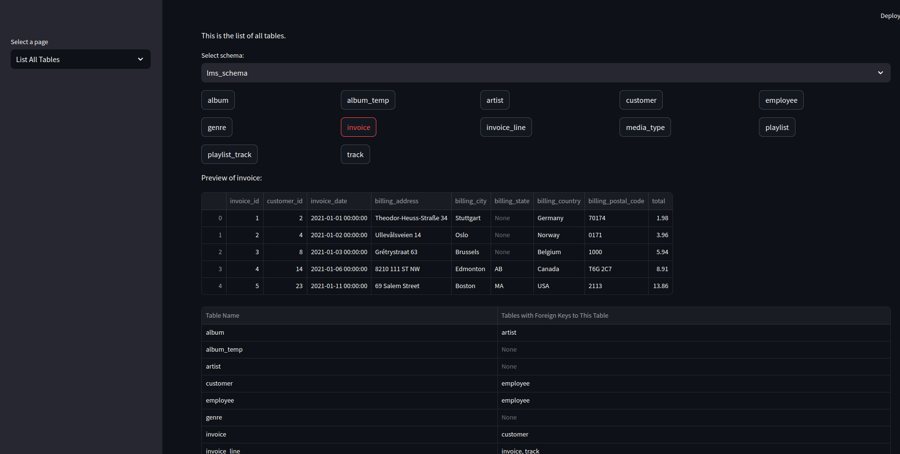
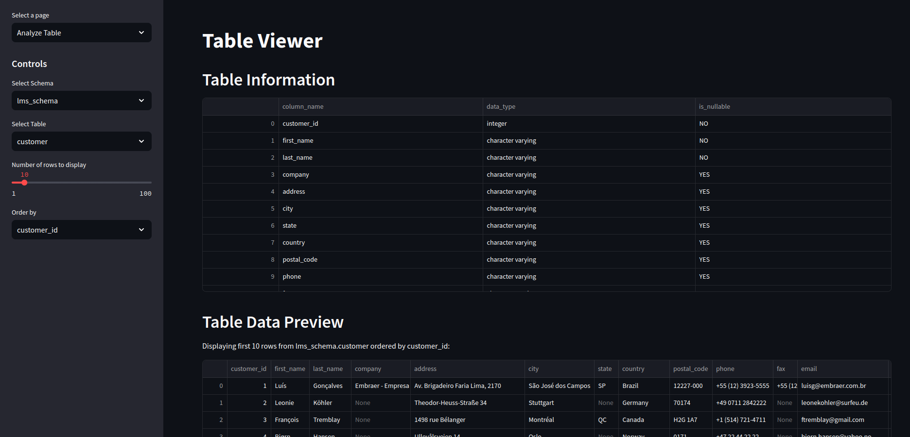
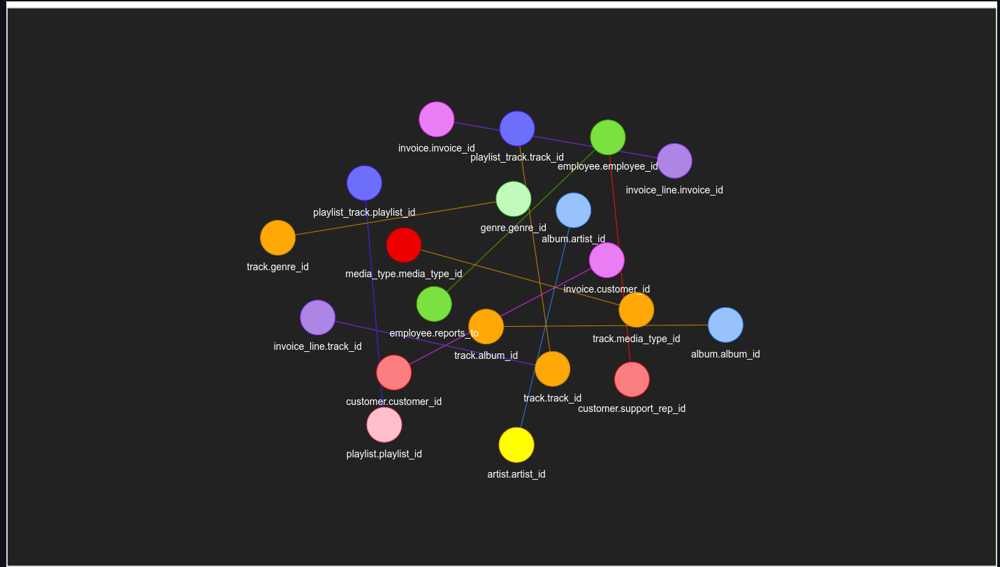

- You can run this `streamlit` app to get the overview of your postgres database.
- You can run this app by using `streamlit run main.py --server.port 8000`
- Following environment variables need to be setup
  - `DB_USERNAME`
  - `DB_PASSWORD`
  - `DB_HOST`
  - `DB_PORT`
  - `DB_NAME`
  - `DEFAULT_SCHEMA`
- I already have a docker image of this application you can pull that using `docker pull smrati/db-dog:v0.0.1`  
---
To run the docker container 
```bash
docker run -e DB_USERNAME=admin_test_db -e DB_PASSWORD=admin123 -e DB_HOST=0.0.0.0 -e DB_PORT=5432 -e DB_NAME=lms -e DEFAULT_SCHEMA=public -p 8501:8501 db-dog:v0.0.1
```

*Please change the environment variables as per your database.*

---

## List all tables in your database , get their relationship with other tables and get the overview of the table by looking into some rows.



---

## Look into the table in detail



---

## Table relationship network (See how tables are related to each other with column information)

